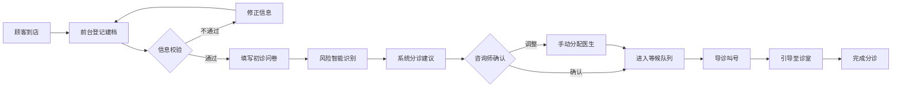

## 1. 产品概述

医美初诊分诊 Web 工作台是一套面向医美机构前台咨询师和现场导诊护士的标准化接诊管理系统，将到院新客从登记、问询到分配医生的全流程数字化、标准化管理。

- **核心价值**：提升接诊效率、降低分诊差错、规范服务流程、优化顾客体验
- **目标用户**：前台咨询师、现场导诊护士、科室管理人员

## 2. 核心功能

### 2.1 用户角色

| 角色 | 登录方式 | 核心权限 |
|------|----------|----------|
| 前台咨询师 | 工号登录 | 顾客登记、问卷管理、分诊建议、标签管理 |
| 导诊护士 | 工号登录 | 分诊看板、叫号引导、状态更新、等待提醒 |
| 管理员 | 工号登录 | 医生排班、数据复盘、系统配置 |

### 2.2 功能模块

1. **接待首页**：今日到诊概览、快捷登记入口、待办提醒、实时统计
2. **顾客档案**：顾客列表、档案详情、扫码建档、信息校验、历史记录
3. **初诊问卷**：求美诉求选择、既往项目填写、过敏史记录、禁忌风险提示、照片采集指引
4. **分诊看板**：等候队列、诊室状态、叫号管理、等待时长提醒、分诊状态流转
5. **医生排班**：医生列表、专长标签、排班日历、空闲时段匹配、诊室分配
6. **到诊复盘**：每日到诊统计、分诊效率分析、渠道来源分布、诉求类型占比

### 2.3 页面详情

| 页面名称 | 模块名称 | 功能描述 |
|----------|----------|----------|
| 接待首页 | 顶部导航 | 模块切换、用户信息、消息通知 |
| 接待首页 | 数据概览 | 今日到诊数、候诊中、分诊中、已完成 |
| 接待首页 | 快捷操作 | 扫码建档、快速登记、查看队列 |
| 接待首页 | 待办提醒 | 待分诊、超时等待、风险提示 |
| 顾客档案 | 顾客列表 | 搜索筛选、分页、档案卡片 |
| 顾客档案 | 档案详情 | 基本信息、就诊历史、标签管理 |
| 顾客档案 | 新增档案 | 身份证校验、手机号验证、来源渠道 |
| 初诊问卷 | 诉求选择 | 皮肤/面部/体型等分类诉求勾选 |
| 初诊问卷 | 健康信息 | 既往项目、过敏史、禁忌症 |
| 初诊问卷 | 风险提示 | 禁忌风险智能识别与警示 |
| 初诊问卷 | 照片指引 | 各角度拍照指引与上传入口 |
| 初诊问卷 | 咨询师标签 | 初步评估标签、备注说明 |
| 分诊看板 | 等候队列 | 按优先级排序的候诊列表 |
| 分诊看板 | 诊室状态 | 各诊室使用状态、当前顾客 |
| 分诊看板 | 叫号操作 | 叫号、引导、完成分诊 |
| 分诊看板 | 等待提醒 | 超时提醒、预估等待时长 |
| 医生排班 | 医生列表 | 医生卡片、专长标签、状态 |
| 医生排班 | 排班日历 | 周视图排班、时段管理 |
| 医生排班 | 分诊建议 | 基于诉求和专长的智能匹配 |
| 到诊复盘 | 数据总览 | 关键指标卡片、趋势图表 |
| 到诊复盘 | 渠道分析 | 来源渠道分布与转化 |
| 到诊复盘 | 分诊效率 | 平均等待时长、分诊耗时 |

## 3. 核心流程

顾客到店后，前台咨询师首先录入顾客基本信息（姓名、年龄、来院渠道、预约项目），系统校验身份证和手机号有效性。接着引导顾客填写初诊问卷，包括求美诉求、既往项目、过敏史等信息，系统自动识别禁忌风险并给出提示。问卷完成后，系统根据顾客诉求、风险等级和医生专长自动给出分诊建议，咨询师可手动调整并说明原因。分诊确认后进入等候队列，导诊护士通过分诊看板实时查看候诊情况和诊室状态，按顺序叫号并引导顾客到对应诊室。

## 4. 用户界面设计

### 4.1 设计风格

- **主色调**：玫瑰金渐变（#D4A574 至 #E8C4A0），传递医美行业的精致与专业感
- **辅助色**：薄荷绿（#7FB7A6）用于成功/安全状态，珊瑚红（#E07A5F）用于警示/风险
- **背景色**：米杏色（#FDF8F3）作为主背景，纯白卡片搭配柔和阴影
- **按钮风格**：圆角矩形（12px），主按钮采用玫瑰金渐变，悬停有微上浮效果
- **字体**：标题使用 Noto Serif SC（衬线字体，显高端），正文使用 Noto Sans SC（易读性强）
- **布局风格**：卡片式布局，左右分栏结构，左侧导航 + 右侧内容区
- **图标风格**：线性图标为主，搭配柔和填充色，保持精致感

### 4.2 页面设计概览

| 页面名称 | 模块名称 | UI 元素 |
|----------|----------|---------|
| 接待首页 | 数据概览 | 渐变数据卡片、数字动画、趋势小箭头 |
| 接待首页 | 快捷操作 | 图标按钮组、悬停微动效 |
| 顾客档案 | 列表卡片 | 头像、标签、状态徽章、滑动操作 |
| 初诊问卷 | 问卷表单 | 分组卡片、分步进度条、选项卡片选择 |
| 初诊问卷 | 风险提示 | 红边警示卡片、图标动画、展开详情 |
| 分诊看板 | 队列卡片 | 优先级标识、等待时长倒计时、状态标签 |
| 分诊看板 | 诊室状态 | 色块区分状态、实时更新动效 |
| 医生排班 | 医生卡片 | 头像、专长标签云、状态指示灯 |
| 医生排班 | 排班日历 | 时间轴视图、拖拽调整、时段色块 |

### 4.3 响应式

- 采用桌面优先设计，以 1440px 宽度为基准
- 支持平板横屏适配（1024px），导航可折叠
- 关键操作区保持触控友好尺寸（最小 44px）

### 4.4 交互细节

- 页面切换采用淡入淡出 + 轻微位移过渡
- 数据更新有数字滚动动画
- 风险提示卡片有呼吸灯效果
- 叫号时有声音提示 + 弹窗动画
- 表单填写有实时保存反馈
