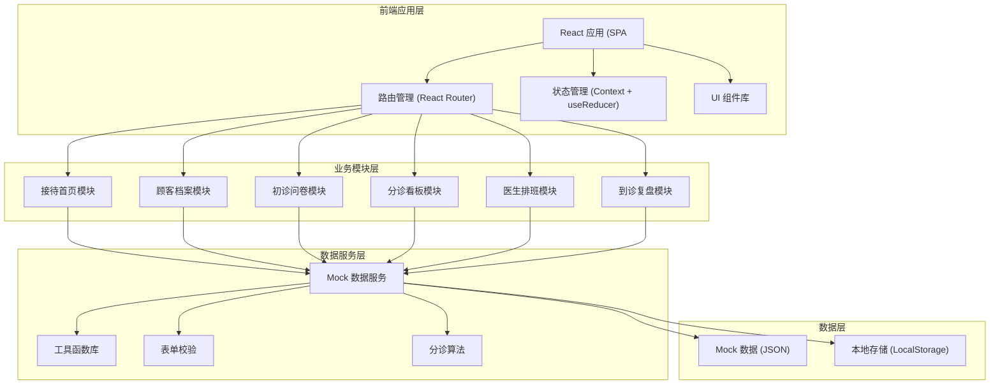
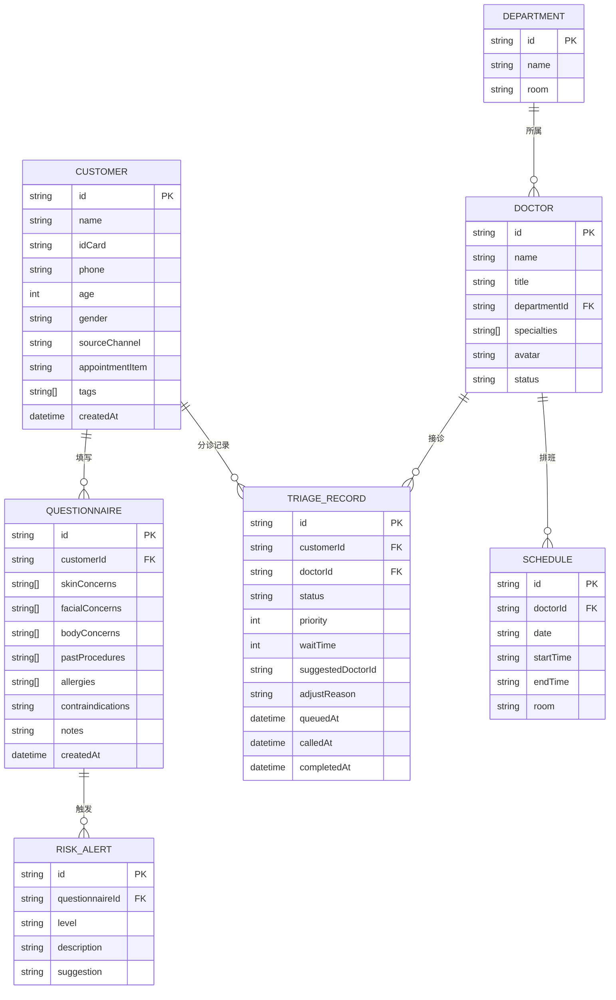

## 1. 架构设计



## 2. 技术描述

- **前端框架**：React@18 + TypeScript
- **构建工具**：Vite@5
- **样式方案**：TailwindCSS@3
- **路由管理**：React Router DOM@6
- **图标库**：Lucide React
- **数据方案**：Mock 数据 + LocalStorage 持久化
- **图表库**：Recharts（用于数据复盘图表）
- **代码规范**：ESLint + Prettier

## 3. 路由定义

| 路由路径 | 页面名称 | 说明 |
|----------|----------|------|
| / | 接待首页 | 今日概览、快捷操作、待办提醒 |
| /customers | 顾客档案 | 顾客列表、档案管理 |
| /customers/new | 新增顾客 | 扫码建档、信息录入 |
| /customers/:id | 顾客详情 | 档案详情、历史记录 |
| /questionnaire/:id | 初诊问卷 | 分步问卷、风险提示 |
| /triage | 分诊看板 | 等候队列、诊室状态、叫号 |
| /doctors | 医生排班 | 医生列表、排班管理 |
| /review | 到诊复盘 | 数据统计、分析图表 |

## 4. 数据模型

### 4.1 实体关系图



### 4.2 核心数据结构

```typescript
// 顾客信息
interface Customer {
  id: string;
  name: string;
  idCard: string;
  phone: string;
  age: number;
  gender: 'male' | 'female';
  sourceChannel: string;
  appointmentItem: string;
  tags: string[];
  photoUrls?: string[];
  createdAt: string;
}

// 问卷信息
interface Questionnaire {
  id: string;
  customerId: string;
  skinConcerns: string[];
  facialConcerns: string[];
  bodyConcerns: string[];
  pastProcedures: string[];
  allergies: string[];
  contraindications: string;
  consultantNotes: string;
  consultantTags: string[];
  riskAlerts: RiskAlert[];
  createdAt: string;
}

// 风险提示
interface RiskAlert {
  id: string;
  level: 'low' | 'medium' | 'high';
  title: string;
  description: string;
  suggestion: string;
}

// 医生信息
interface Doctor {
  id: string;
  name: string;
  title: string;
  departmentId: string;
  departmentName: string;
  specialties: string[];
  avatar: string;
  status: 'available' | 'busy' | 'offline';
  room: string;
}

// 分诊记录
interface TriageRecord {
  id: string;
  customerId: string;
  customerName: string;
  doctorId: string;
  doctorName: string;
  departmentName: string;
  room: string;
  status: 'queued' | 'calling' | 'consulting' | 'completed';
  priority: number;
  waitTime: number;
  estimatedWait: number;
  suggestedDoctorId: string;
  isManualAdjusted: boolean;
  adjustReason?: string;
  queuedAt: string;
  calledAt?: string;
  completedAt?: string;
}

// 排班信息
interface Schedule {
  id: string;
  doctorId: string;
  doctorName: string;
  date: string;
  startTime: string;
  endTime: string;
  room: string;
  type: 'morning' | 'afternoon' | 'full';
}
```

## 5. 组件结构

```
src/
├── components/          # 公共组件
│   ├── Layout/          # 布局组件
│   │   ├── Sidebar.tsx   # 侧边导航
│   │   ├── Header.tsx    # 顶部栏
│   │   └── index.tsx
│   ├── Card/            # 卡片组件
│   ├── Form/            # 表单组件
│   ├── StatusBadge.tsx      # 状态徽章
│   ├── Tag.tsx           # 标签组件
│   └── Modal/           # 弹窗组件
├── pages/               # 页面组件
│   ├── Dashboard/       # 接待首页
│   ├── Customer/        # 顾客档案
│   ├── Questionnaire/   # 初诊问卷
│   ├── Triage/         # 分诊看板
│   ├── Doctor/         # 医生排班
│   └── Review/         # 到诊复盘
├── mock/               # Mock 数据
├── hooks/              # 自定义 Hooks
├── utils/              # 工具函数
│   ├── validator.ts    # 校验工具
│   ├── triage.ts       # 分诊算法
│   └── format.ts      # 格式化工具
├── types/              # TypeScript 类型
├── store/              # 状态管理
└── App.tsx
```

## 6. 核心算法

### 6.1 分诊匹配算法

- 基于顾客诉求类型匹配医生专长
- 考虑医生当前忙闲状态
- 结合风险等级调整优先级
- 计算预估等待时长

### 6.2 风险识别规则

- 过敏史匹配禁忌项目
- 既往项目间隔时间检查
- 特殊体质风险评估
- 自动生成风险提示等级

### 6.3 身份证校验

- 18 位身份证格式校验
- 出生日期提取年龄计算
- 性别提取
